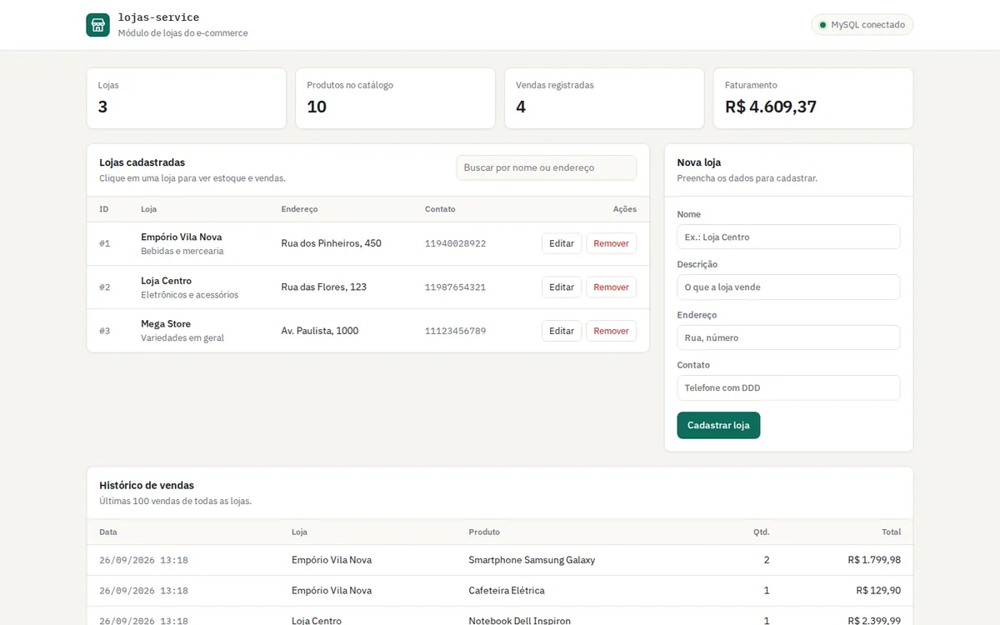
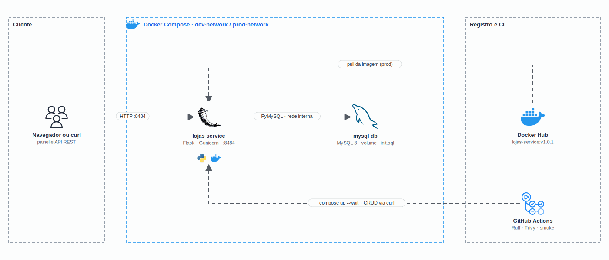

<h1 align="center">
  GS1 - Microserviço de lojas com Docker e Docker Compose
</h1>

<p align="center">
  
</p>

<p align="center">
  <a href="https://skillicons.dev">
    
  </a>
</p>

## Qual a finalidade do projeto?

Global Solution 1 da disciplina de **Cloud Developer** (FIAP, maio de 2025), com foco em **Docker**. O desafio era containerizar um microserviço de um e-commerce junto com o banco relacional, com ambientes de **desenvolvimento e produção separados**, imagem otimizada e publicada no **Docker Hub**, e análise de segurança da imagem.

O serviço escolhido foi o **lojas-service**: uma API em Flask com MySQL que cadastra lojas, associa produtos ao estoque de cada loja, registra vendas e mostra o histórico. Ele vem com um painel web para usar tudo pelo navegador.

## Arquitetura

<p align="center">
  
</p>

## O que foi construído

### Containers e ambientes

| Item | Desenvolvimento (`docker-compose.dev.yml`) | Produção (`docker-compose.prod.yml`) |
|---|---|---|
| Imagem do app | `dockerfile.dev`, build local | `dockerfile` multi-stage, `william201192/lojas-service:${IMAGE_TAG}` |
| Servidor | `flask run --reload` com o código montado (hot reload) | Gunicorn com 2 workers |
| MySQL | `mysql:8.0-debian`, porta publicada só em `127.0.0.1:3308` | `mysql:8.0-debian` sem porta publicada, rodando como usuário `mysql` |
| Volume | `ecommerce_dev_mysql_data` | `ecommerce_prod_mysql_data` |
| Rede | `ecommerce_dev_network` | `ecommerce_prod_network` |
| Endurecimento | usuário não-root no app | usuário não-root + `no-new-privileges` nos dois containers |

O `docker-compose.yml` é a base comum aos dois: variáveis, `init.sql` e healthchecks.

### Boas práticas aplicadas

| Prática | Como está no projeto |
|---|---|
| Imagem enxuta | Multi-stage em `python:3.12-alpine`: compilação no `builder`, só runtime na imagem final, sem pip |
| Usuário não-root | `appuser` (UID 1001) nas duas imagens |
| Segredos fora do código | Senhas só no `.env`; o Compose falha se faltarem (`${VAR:?}`) e o app usa um usuário próprio, não o root |
| Healthchecks | MySQL via TCP (`mysqladmin ping -h 127.0.0.1`) e app via `GET /status`, que devolve 503 se o banco cair |
| Ordem de subida | `depends_on: condition: service_healthy`: o app só sobe com o banco pronto |
| Dados iniciais | `init.sql` cria 16 tabelas e carrega categorias, produtos, estoque, 3 lojas e vendas de exemplo |
| CI | GitHub Actions com Ruff, Trivy e smoke test do CRUD nas stacks dev e prod |

### API

| Rota | O que faz |
|---|---|
| `GET /` | Painel web |
| `GET /status` | Status do serviço e do banco (200 conectado, 503 desconectado) |
| `GET /lojas` · `POST /lojas` | Lista lojas · cadastra (`nome` obrigatório; aceita formulário ou JSON) |
| `GET /lojas/<id>` · `PUT /lojas/<id>` · `DELETE /lojas/<id>` | Consulta, substitui os campos e remove uma loja (404 se não existir) |
| `POST /produtos_lojas` | Associa um produto à loja, com quantidade e preço opcionais |
| `GET /dashboard/<id>` | Loja com estoque e vendas |
| `POST /vendas` | Registra uma venda |
| `GET /produtos` | Catálogo de produtos |
| `GET /historico[?loja_id=<id>]` | Últimas 100 vendas, de todas as lojas ou de uma |

### Segurança da imagem

A imagem passou por varredura de vulnerabilidades desde a primeira publicação. Na `v1.0.0`, o **Docker Scout** apontou 7 vulnerabilidades (1 crítica, 2 altas, 3 médias e 1 baixa). A crítica era a **CVE-2024-36039** (SQL injection no PyMySQL 1.1.0, CVSS 9.8), tratada com o PyMySQL 1.1.1, junto com `cryptography` 43.0.1 e `requests` 2.32.0.

Hoje as dependências estão em Flask 3.1.3, Werkzeug 3.1.6, cryptography 50.0.0 e requests 2.33.0, e a imagem final não carrega o pip. O **Trivy** não encontra nenhuma CVE conhecida na imagem de produção (varredura de 26/09/2026):

```text
william201192/lojas-service:v1.0.1 (alpine 3.24.2)
Total: 0 (UNKNOWN: 0, LOW: 0, MEDIUM: 0, HIGH: 0, CRITICAL: 0)
```

No Docker Hub estão publicadas as tags `v1.0.0` e `latest` ([william201192/lojas-service](https://hub.docker.com/r/william201192/lojas-service)). Se a tag de `IMAGE_TAG` não existir lá, o Compose de produção constrói a imagem localmente.

## Tecnologias utilizadas

- **Python 3.12 + Flask:** API e painel; **Gunicorn** em produção;
- **PyMySQL:** acesso ao MySQL, sempre com consultas parametrizadas;
- **MySQL 8.0:** banco relacional com volume nomeado por ambiente;
- **Docker e Docker Compose:** imagens multi-stage Alpine, override de dev e prod, redes e volumes isolados;
- **HTML, CSS e JavaScript puro:** painel com tema claro e escuro, sem framework;
- **GitHub Actions + Ruff + Trivy:** lint, varredura de dependências e smoke test.

## Estrutura do repositório

```text
fiap-docker-gs1/
├── lojas-service/
│   ├── app.py               # API Flask: lojas, estoque, vendas, histórico e /status
│   ├── dockerfile           # Produção: multi-stage Alpine, não-root, Gunicorn
│   ├── dockerfile.dev       # Desenvolvimento: flask run --reload
│   ├── requirements.txt
│   ├── templates/index.html # Painel
│   └── static/              # CSS, JavaScript e favicon
├── docker-compose.yml       # Base: MySQL + app, variáveis e healthchecks
├── docker-compose.dev.yml   # Override de desenvolvimento
├── docker-compose.prod.yml  # Override de produção
├── init.sql                 # Esquema e dados de exemplo
├── .env.dev.example         # Modelo de variáveis de dev
├── .env.prod.example        # Modelo de variáveis de prod
├── .github/workflows/ci.yml # Lint, Trivy e smoke test
└── docs/                    # Demo e diagrama
```

## Fluxo de funcionamento

1. O `docker compose up` sobe o MySQL, que roda o `init.sql` no primeiro start do volume.
2. Quando o MySQL responde por TCP, o healthcheck fica verde e o Compose libera o `lojas-service`.
3. O navegador (ou o `curl`) chama a API na porta 8484; o Flask consulta o MySQL pela rede interna do Compose.
4. O painel lista as lojas, cadastra, edita e remove; ao abrir uma loja, mostra estoque e vendas e permite associar produtos e registrar vendas.
5. Em produção a imagem vem do Docker Hub (ou é construída localmente) e o banco não tem porta publicada no host.

## Como rodar

Pré-requisito: Docker com o plugin Compose v2.

### Desenvolvimento

```bash
cp .env.dev.example .env.dev        # troque as senhas
docker compose -f docker-compose.yml -f docker-compose.dev.yml --env-file .env.dev up -d --build --wait
# painel em http://localhost:8484 · MySQL em 127.0.0.1:3308
```

### Produção

```bash
cp .env.prod.example .env.prod      # use senhas fortes
docker compose -f docker-compose.yml -f docker-compose.prod.yml --env-file .env.prod up -d --wait
```

Para publicar uma nova versão da imagem:

```bash
docker build -t william201192/lojas-service:v1.0.1 ./lojas-service
docker login && docker push william201192/lojas-service:v1.0.1
```

Para parar, troque `up -d ...` por `down` (os dados continuam no volume) ou `down -v` (apaga o volume).

## Como validar a entrega

Os comandos abaixo usam a porta padrão 8484.

```bash
# Healthchecks: os dois containers aparecem como (healthy)
docker compose -f docker-compose.yml -f docker-compose.prod.yml --env-file .env.prod ps

# Status do serviço e do banco
curl http://localhost:8484/status

# CRUD de lojas
curl -X POST -d "nome=Loja Centro&descricao=Eletrônicos&endereco=Rua A, 123&contato=11999999999" http://localhost:8484/lojas
curl http://localhost:8484/lojas/4
curl -X PUT -H "Content-Type: application/json" -d '{"nome":"Loja Centro 2","endereco":"Rua B, 50"}' http://localhost:8484/lojas/4
curl -X DELETE http://localhost:8484/lojas/4

# Estoque, venda e histórico
curl -d "loja_id=1&produto_id=7&quantidade_estoque=12&preco_loja=22.50" http://localhost:8484/produtos_lojas
curl -d "loja_id=1&produto_id=7&quantidade=2&valor_total=45.00" http://localhost:8484/vendas
curl "http://localhost:8484/historico?loja_id=1"

# Varredura da imagem de produção
docker run --rm -v /var/run/docker.sock:/var/run/docker.sock aquasec/trivy image william201192/lojas-service:v1.0.1

# Backup lógico do banco
docker compose -f docker-compose.yml -f docker-compose.prod.yml --env-file .env.prod exec -T mysql-db \
  sh -c 'mysqldump -uroot -p"$MYSQL_ROOT_PASSWORD" --single-transaction ecommerce_db' > backup.sql
```

Pontos principais de validação:

- os dois containers ficam `healthy` e o app só sobe depois do banco;
- `POST` devolve 201, `PUT` e `DELETE` devolvem 200, e uma loja inexistente devolve 404;
- parar o MySQL faz o `/status` responder 503;
- `down` seguido de `up` mantém as lojas cadastradas (volume nomeado);
- `docker compose exec lojas-service id` mostra `uid=1001(appuser)`.

---

## Autor

**William Coelho** · RM 556336 · [@willtechdev](https://github.com/willtechdev)
